# DAILY-DEALS-ECOMMERCE-APPLICATION :star_struck: 

[](https://shields.io/) [](https://shields.io/) [](https://shields.io/) [](https://shields.io/) [](https://shields.io/) [](https://shields.io/) [](https://shields.io/) [](https://shields.io/) [](https://shields.io/)

***This new e-commerce application named 'DAILY DEALS' is created by Biswarup Bhattacharjee, student of BTECH, in University of Engineering and Management, Kolkata.***

**Email Id: bbiswa471@gmail.com.** 

**Contact No: 916290272740.** 

<p align="left">
<a href="https://www.facebook.com/profile.php?id=100070395300810" target="blank"></a>
<a href="https://instagram.com/biswarup2210" target="blank"></a>
<a href="https://github.com/biswa2210/biswa2210" target="blank"></a>
</p>

## About :point_down: 

<div align="justified">
       
This is an e-commerce grocery shopping application for android and ios. Here is register or login option when user opens for the first time. Here user has to register for the first time using email id, phone number, username and password. After the firt time user has to login with email id and password. Here is also a sigh out option for security purpose. In this grocery app there is a search engine where user can search products by name, company or categories. These search engine is made for making it user-friendly. Here are total 24 categories and 156 products in specific quantities. We can check products by choosing different categories. In each product there is a slider of images of that product and detailed description of that product including quantity, company name, availability status, price. Here is an Add button to add that product in cart. In the cart we can find tha product. Later we can easily order that item. There are two buttons here. Clear button is used for clearing the cart. If we want to order that product we have to proceed with Checkout button. There are 3 steps for ordering SHIPPING, PAYMENT and CONFIRM. In the Shipping Address part we have to give proper phone number, shipping address 1 and 2, city and a zip code for security. Here is also a drop down menu for choosing the country name. In the next part we can choose payment method among Cash on Delivery, Bank Transfer and Card Payment. After that we can proceed with CONFIRM button. In the final step we can place order. We can see our order in account section. Here we can see all detrails regarding our order. We can check the status of that order. 
       
</div>

## Catagories of Products in this app :point_down:

 - [x] 'Non-Alcoholic'

 

       
## APP DOWNLOAD LINK : :point_right: <a href="https://drive.google.com/file/d/1O581pW6KX2VRc57nARgiddNmK7ykywtB/view" download>Click here to download</a>

## Purpose :point_down:

<div align="justified">
       

</div>

## Use :point_down:

<div align="justified">
       

</div>      
       
## Importance :point_down:

<div align="justified">

</div>

## Folder Structure :point_down:
```bash
mocktail-recipe-finder
       ├── assets
       |     ├── fonts
       |     |     ├── CT.ttf

       |     └── images
       |           ├── attachment.gif
       |           └── loading.gif

 ```                      

## Making :point_down:

<div align="justified">

I have used [FLUTTER](https://flutter.dev/?gclid=Cj0KCQjw38-DBhDpARIsADJ3kjliHdMH2hA97bBGqJtW5ORUUksCxpZ8cnrSWaH__HevGftAmP8AmvIaAhNlEALw_wcB&gclsrc=aw.ds) and [Dart](https://dart.dev/) in front end and backend. I have used total six screens. Mocktail catagories screen, favourites screen, filter screen, Mocktail recipe description screen, tap screen, catagories screen. I have designed this using [Materials ui](https://material-ui.com/). I have loaded the entire app in main.dart.
  
</div>

## Screenshots :point_down: 

<div align="center">
       
For non-admin or ordinary users
       
<a href="pics/d0.jpeg">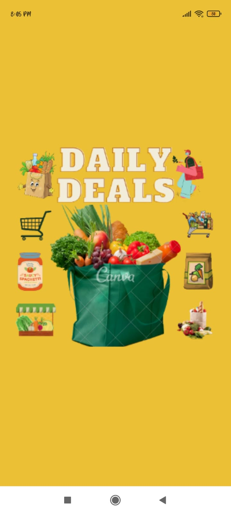</a> <a href="pics/d1.jpeg">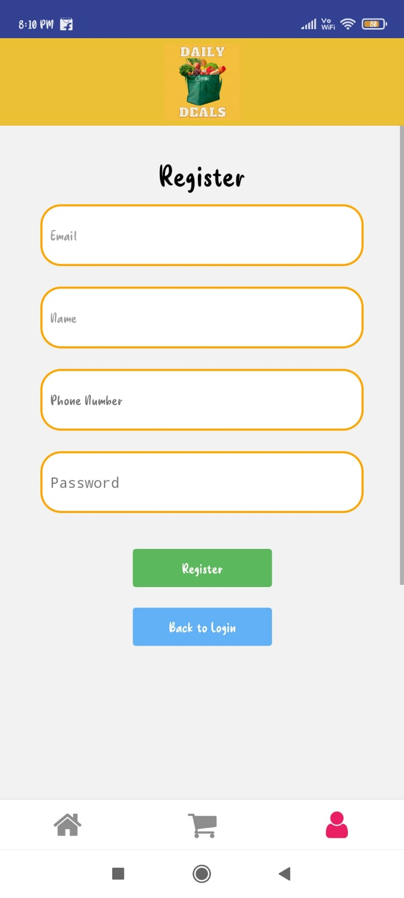</a> <a href="pics/d2.jpeg">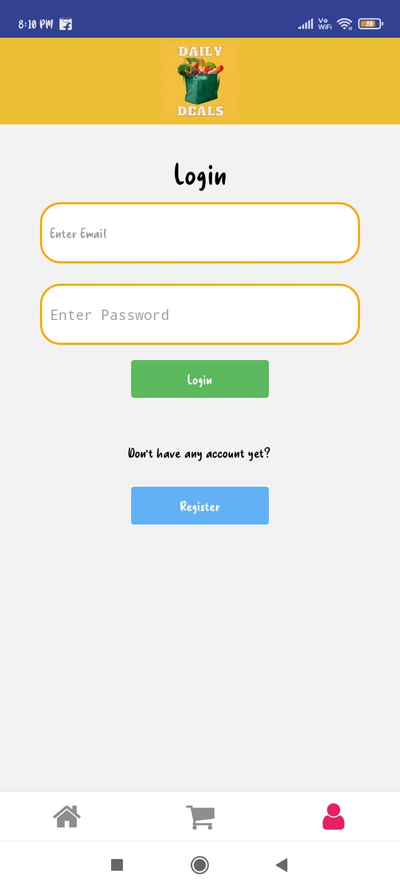</a>
       
<a href="pics/d3.jpeg"></a> <a href="pics/d4.jpeg">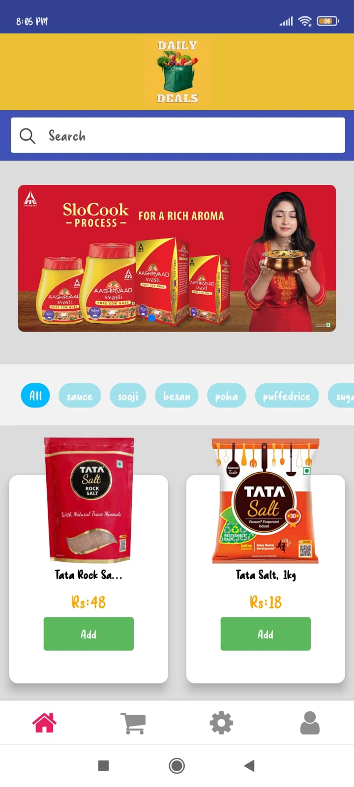</a> <a href="pics/d5.jpeg">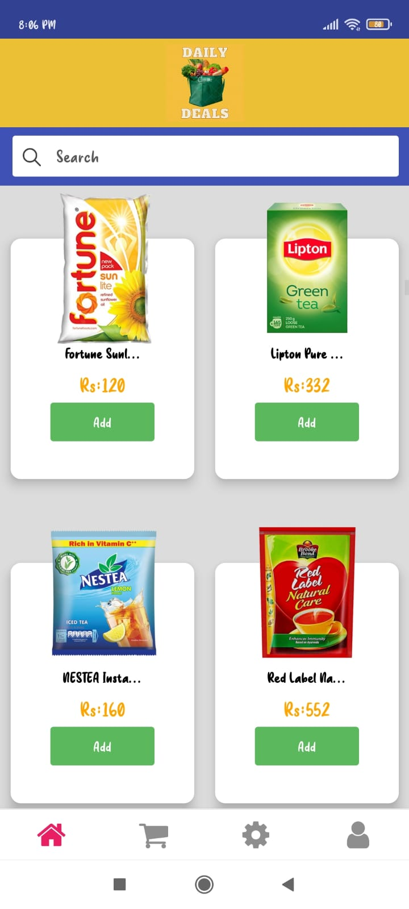</a>
       
<a href="pics/d6.jpeg">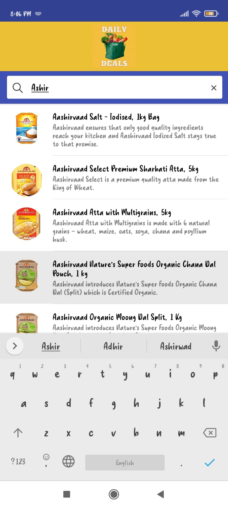</a> <a href="pics/d7.jpeg">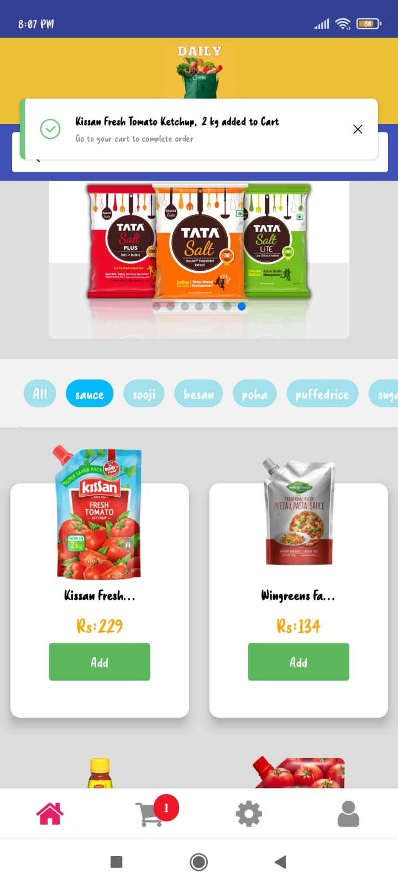</a> <a href="pics/d8.jpeg">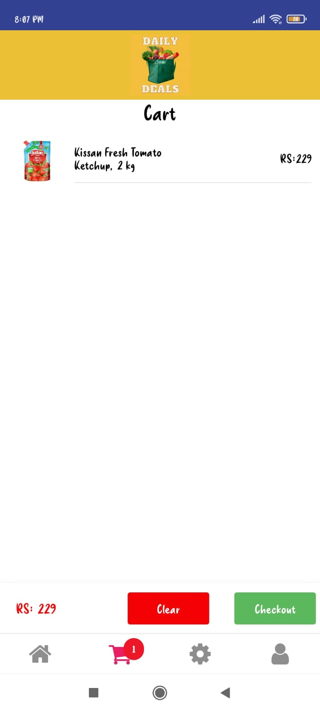</a>
       
<a href="pics/d9.jpeg">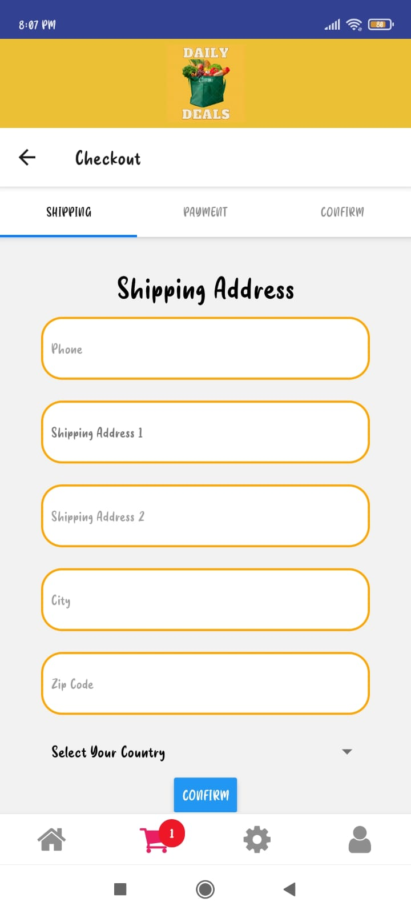</a> <a href="pics/d10.jpeg">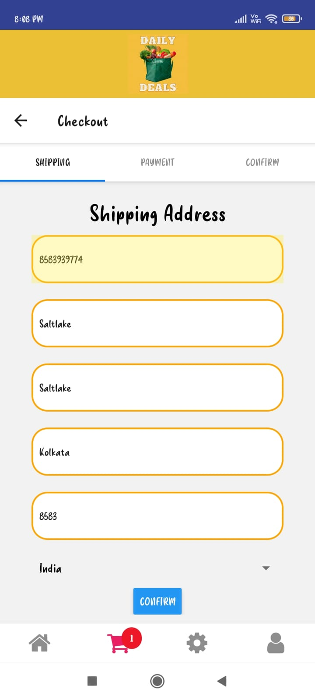</a> <a href="pics/d11.jpeg">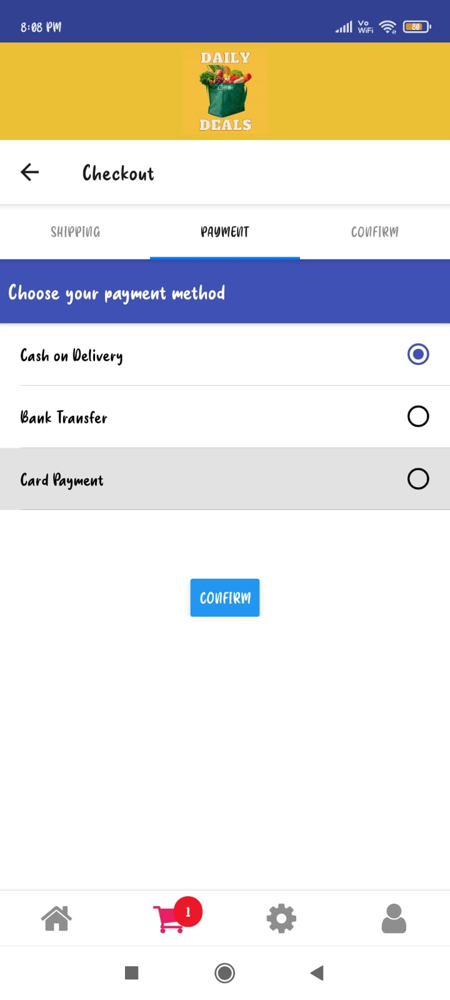</a>
       
For admin users this following part is additional       
       
<a href="pics/d12.jpeg">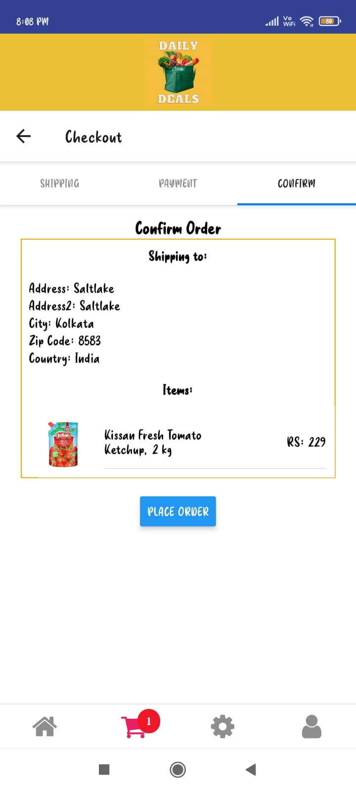</a> <a href="pics/d13.jpeg">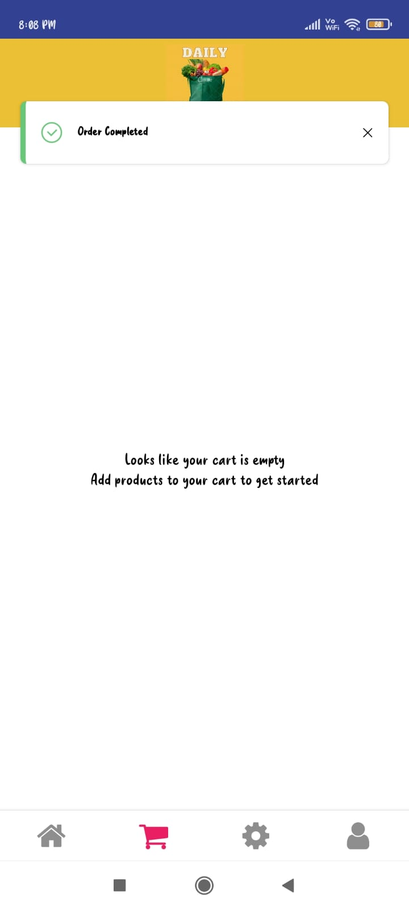</a> <a href="pics/d14.jpeg">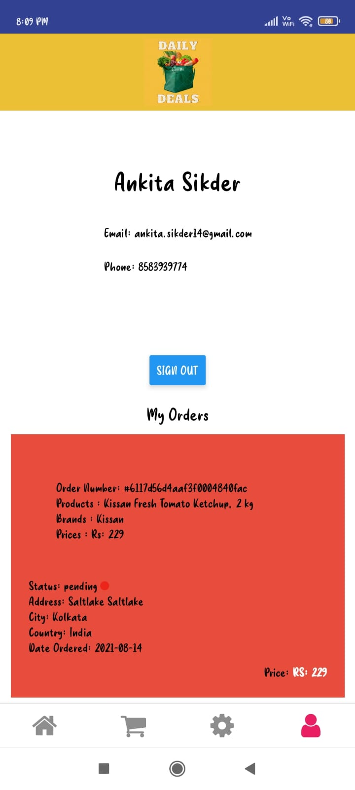</a>
     
<a href="pics/d15.jpeg">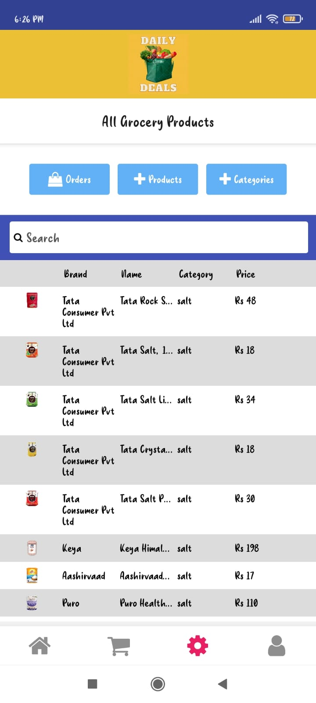</a> <a href="pics/d16.jpeg"></a> <a href="pics/d17.jpeg">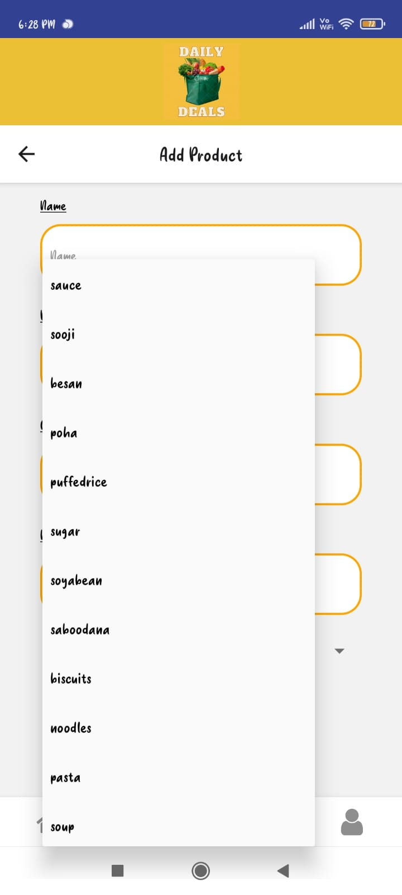</a>
       
<a href="pics/d18.jpeg">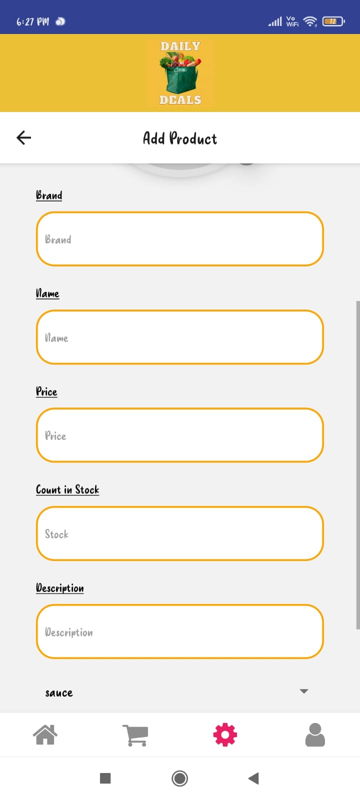</a> <a href="pics/d19.jpeg"></a> <a href="pics/d20.jpeg">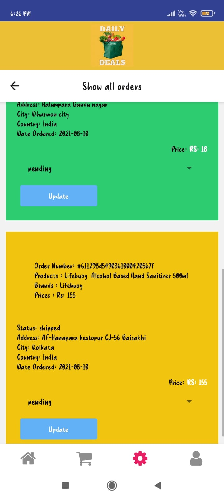</a>
      
</div>


